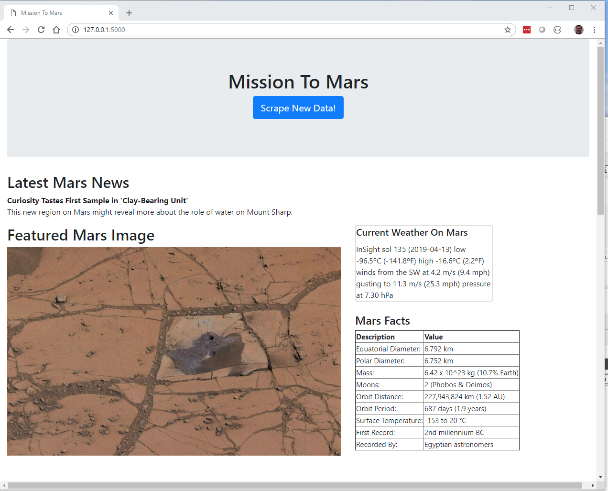
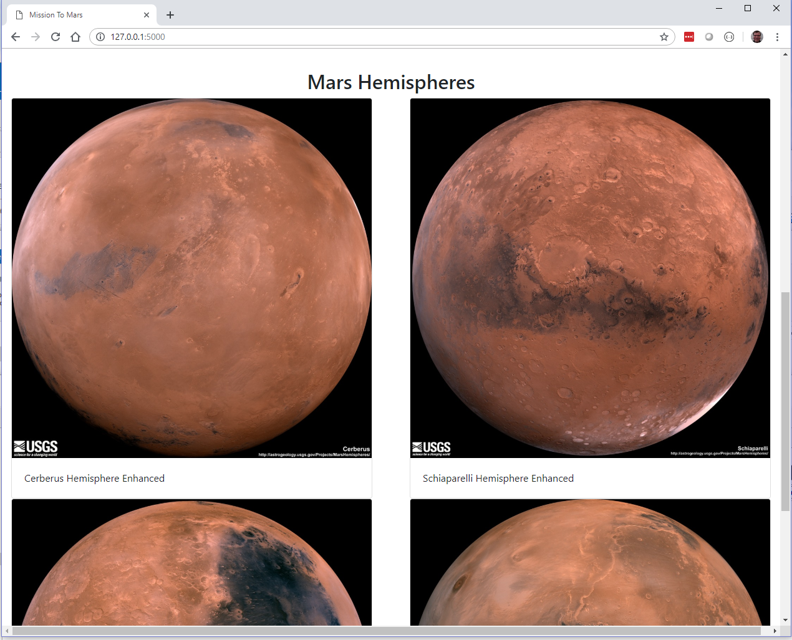
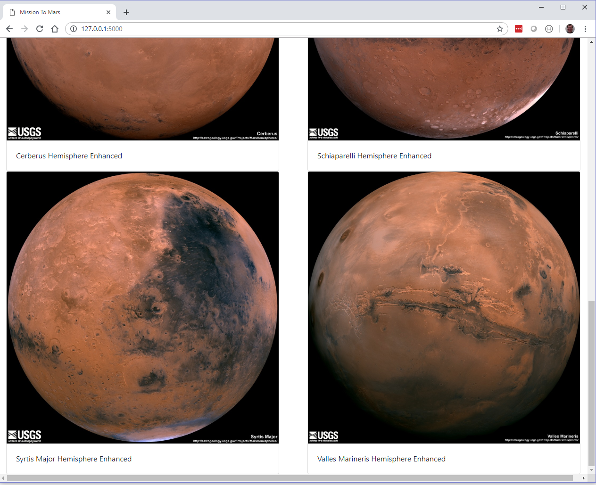

# mission_to_mars
Mission To Mars Web Scraping Python/Splinter/Flask/Jinja/MongoDB/HTML/Bootstrap Project

PROJECT NAME: Mission To Mars  
DESCRIPTION: Data Analytics Boot Camp  
DUE: 17Apr2019  
PROGRAMMER:  Eric Staveley  MWSa Session  

SUMMARY:
Develop web scraping python script, implement with FLASK app.py and use a base index.html
template to dynamically adjust upon a user button click that refreshes a web scraping
of various Mars sites and saves and retrieves to a Mongo (No SQL) database, 
to show the user information on Mars.

Files posted to this repo:
mission_to_mars.ipynb (Jupyter Notebook File)
scrape_mars.py (py script converted from the above ipynb file)
app.py (FLASK web server)
templates/index.html (base html template populated via FLASK and Web Scraping py file)
chromedriver.exe (driver used during DEV to ensure scraping site display on PC platform)
3 screenshots in .png format showing output to browser connected to FLASK server @ 127.0.0.1
README.md (this readme.md file that you are reading)

## OUTPUT UPON A USER BUTTON CLICK

## TABLE OF CONTENTS

None  

## INSTALLATION
Ensure all files are downloaded from this repo, maintaining file and dir structre. 
app.py is to be invoked in the command line with python.  
Classroom  PythonData env was used.   2.7

## USAGE

n/a

## CONTRIBUTING

n/a

## CREDITS

n/a

## LICENSE

n/a

